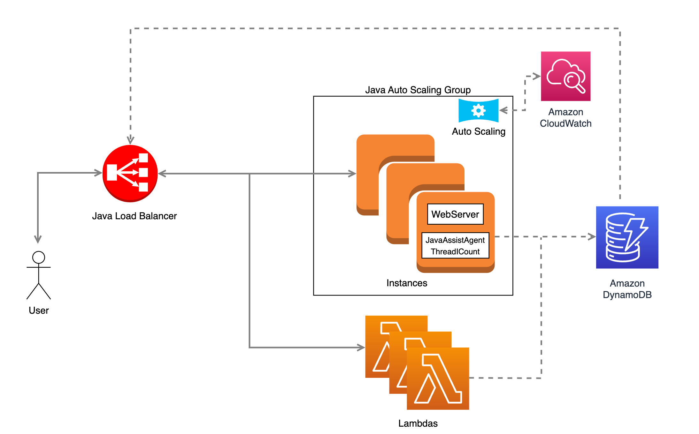

Instituto Superior Técnico

Master's Degree in Computer Science and Engineering

Cloud Computing and Virtualization 2022/2023

Project Grade: 19.89 / 20.00

# EcoWork @ Cloud

The **EcoWork @ Cloud** project consists on designing and implementing a system running within the Amazon Web Services (AWS) ecosystem. The system is composed of workers, including EC2 instances and Lambdas, a Load Balancer, an Auto-Scaler, and a metrics storage system held by DynamoDB.

<p align="center">
    
</p>

# Architecture

The project is composed of five distinct modules:
- `webserver` and `javassist` - instrumentalization done with ThreadICount:
- `applications` - foxes rabbits, insect war, image compression
- `awsmanagement` - load balancer and auto scaler
- `mss` - dynamodb utilities for loadbalancer and lambdas
- `instrumented-lambdas-jars` - contains two jars with instrumented bytecode to be executed in AWS Lambda functions

# Requirements

- Java >= 11.0.22
- Apache Maven >= 3.6.3
- [AWS Command Line Interface (CLI)](https://docs.aws.amazon.com/cli/latest/userguide/getting-started-install.html) >= 2.13.1

Install the necessary dependencies for java and maven

``` zsh
sudo apt-get -y install openjdk-11-jdk maven 
```

Configure your aws credentials

``` zsh
aws configure
```

# Getting Started

## Running in AWS

Create a copy of `scripts/aws-infrastructure/config-template.sh` and rename it to `scripts/aws-infrastructure/config.sh`.
Fill in your configuration accordingly.

Go to the scripts folder and make sure every bash script can be executed with the correct permissions:

``` zsh
cd scripts/aws-infrastructure
sudo chmod 700 *.sh 
```

Load your configuration settings in `config.sh`:

``` zsh
source config.sh
```

Create a Web Server image (AMI) to be used by the AWS Management (Load Balancer and Auto Scaler):

``` zsh
./webserver-create-image.sh
```

**[OPTIONAL]**: jars are already available in the `instrumented-lambda-jars` folder but if you intend to generate new jars you can run the following script after
making sure you have the output directory with the necessary instrumented byte code - to do that, you need to: compile webserver, run instrumented webserver, send requests to web server

``` zsh
./lambda-generate-instrumented-jars.sh
```

Register lambda functions for foxes-rabbits, insect-war and image-compression.
*[NOTE]* After each function is registered, don't forget to press Q!

``` zsh
./lambda-register-functions.sh
```

Go to `awsmanagement` resources folder and edit the `config.json` file with the AMI created in the previous step.

Create and deploy an EC2 instance with Load Balancer and Auto Scaler:
*[NOTE]* The final step in the script connects to the machine via SSH and starts running the application remotely.
*[NOTE]* If you don't wish to observe the debug prints in the instance, you can stop/exit the script/terminal and the application will continue to run safely.

``` zsh
./loadbalancer-autoscaler-deploy.sh
```


## Running Locally

If you wish to run the project for testing purposes, you can run the project locally.

Just make sure to use different ports for the webserver and loadbalancer/autoscaler

Building the project:

``` zsh
mvn compile install
```

Running Load Balancer and Auto Scaler:

``` zsh
cd awsmanagement
mvn exec:java
```

Running Web Server with instrumentation:

``` zsh
java -cp webserver/target/webserver-1.0.0-SNAPSHOT-jar-with-dependencies.jar -Xbootclasspath/a:javassist/target/JavassistWrapper-1.0-jar-with-dependencies.jar -javaagent:webserver/target/webserver-1.0.0-SNAPSHOT-jar-with-dependencies.jar=ThreadICount:pt.ulisboa.tecnico.cnv.compression,pt.ulisboa.tecnico.cnv.insectwar,pt.ulisboa.tecnico.cnv.foxrabbit,javax.imageio:output pt.ulisboa.tecnico.cnv.webserver.WebServer
```

Running Web Server without instrumentation:

``` zsh
java -cp webserver/target/webserver-1.0.0-SNAPSHOT-jar-with-dependencies.jar pt.ulisboa.tecnico.cnv.webserver.WebServer
```

